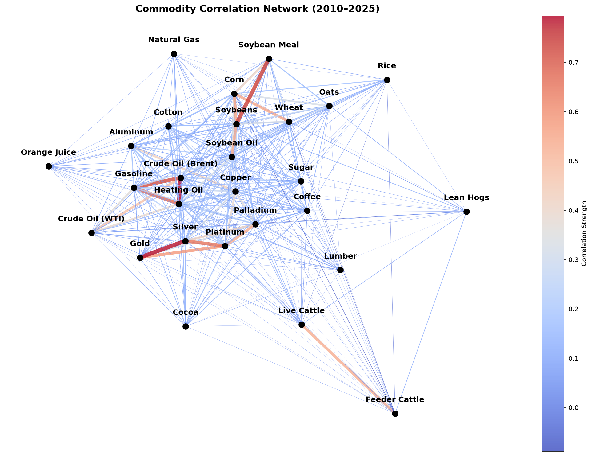
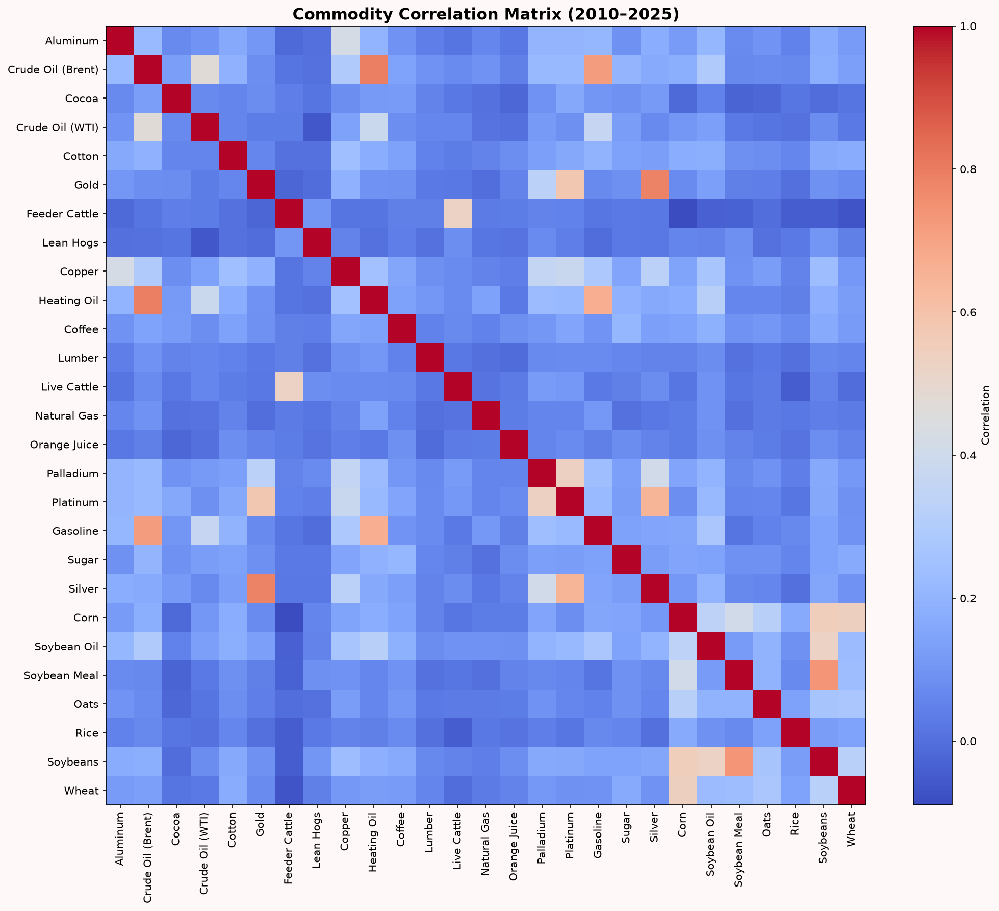
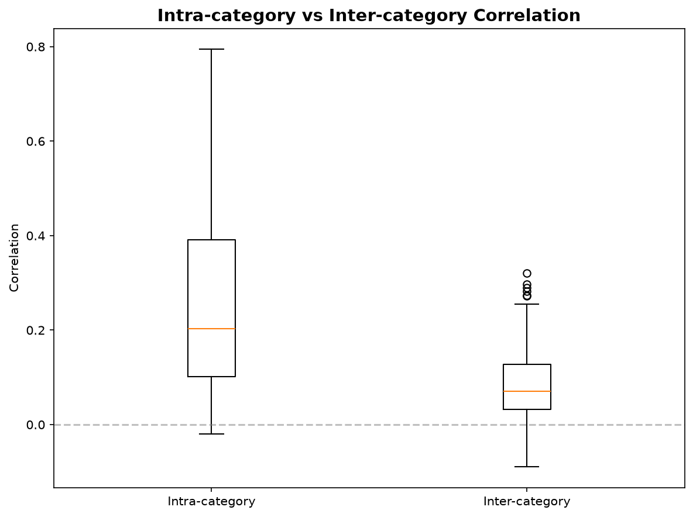
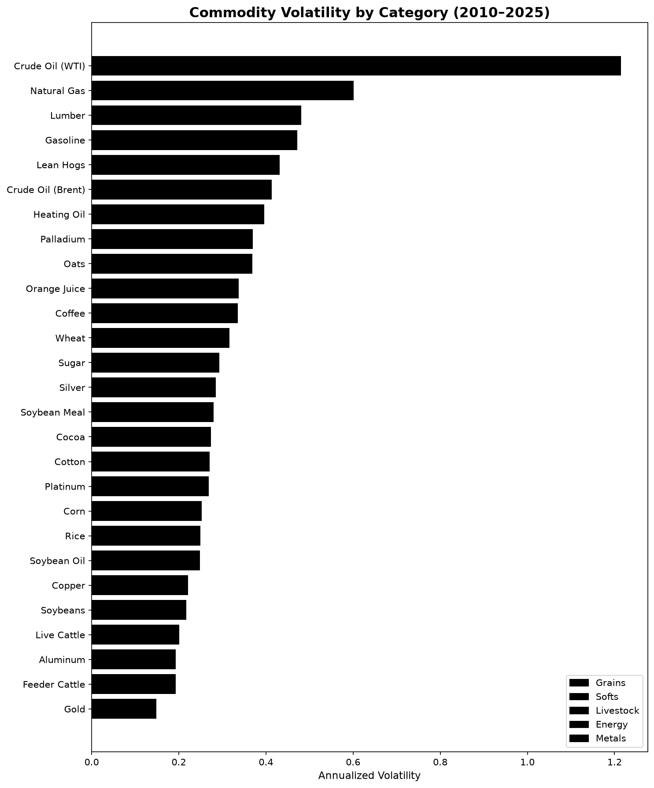

# Commodity Correlation Network: Structure and Diversification (2010–2025)

## Overview

This project explores the correlation structure of 27 commodity futures spanning five major sectors — grains, softs, livestock, energy, and metals — using fifteen years of daily price data (2010–2025). The goal is not just to visualize relationships between assets, but to test, statistically, whether commodities genuinely group by economic sector or whether apparent patterns are mainly statistical noise.

This distinction matters. Visualizations of correlation networks are common in finance, but they can be misleading if interpreted at face value: Weak correlations may arise from common macroeconomic shocks, changing market regimes, or sampling variability, even when no stable economic relationship exists. This project explicitly distinguishes between visual patterns and statistically supported evidence.

## Data

- **Source:** Yahoo Finance (yfinance)
- **Assets:** 27 commodity futures across 5 categories
- **Period:** January 2010 — December 2025
- **Frequency:** Daily
- **Observations:** 3,950 trading days

### Assets by Category

| Category | Commodities |
|---|---|
| Grains | Corn, Wheat, Soybeans, Soybean Meal, Soybean Oil, Oats, Rice |
| Softs | Coffee, Cocoa, Sugar, Cotton, Orange Juice, Lumber |
| Livestock | Live Cattle, Feeder Cattle, Lean Hogs |
| Energy | Crude Oil (WTI), Crude Oil (Brent), Natural Gas, Gasoline, Heating Oil |
| Metals | Gold, Silver, Copper, Platinum, Palladium, Aluminum |

## Methodology

1. Download daily closing prices for all 27 futures
2. Calculate daily percentage returns
3. Build a full correlation matrix
4. Construct a correlation network: nodes are commodities, edges 
   connect pairs with correlation above a low threshold |ρ| > 0.01, that was chosen to preserve weak relationships and avoid imposing an arbitrary notion of "strong" correlation. The network is therefore intended as an exploratory visualization rather than evidence by itself.
5. Test whether intra-category correlations are statistically 
   higher than inter-category correlations
6. Calculate annualized volatility for each commodity

## Visualizations

The repository includes:

- Commodity Correlation Heatmap
- Correlation Network
- Annualized Volatility by Commodity Category
- Intra- vs Inter-category Correlation Comparison

## Results

### 1. Correlation Network

The network reveals visually coherent clusters/groups: energy products (WTI, Brent, gasoline, heating oil) are tightly interconnected, the same way as precious metals are (gold, silver, platinum, palladium) and several grain pairs (soybeans, soybean meal, corn, wheat). Livestock and several softs (coffee, cocoa, orange juice) remain largely isolated, showing little correlation with anything else in the dataset.

### Correlation Heatmap

A complementary view of the same correlation matrix, showing all pairwise correlations at once. This makes it easier to spot intra-category blocks of high correlation (visible as brighter 
clusters along the diagonal blocks) versus the mostly dark, low-correlation areas between unrelated sectors.

### 2. Intra-category vs Inter-category Correlation

To move beyond visual interpretation, I compared the distribution of correlations within the same category against correlations across different categories.

| Metric | Intra-category | Inter-category |
|---|---|---|
| Median correlation | ~0.20 | ~0.08 |
| Range | -0.02 to 0.80 | -0.10 to 0.30 (with outliers) |

Commodities within the same sector are, on average, considerably 
more correlated with each other than with commodities from 
different sectors. This confirms that sector-based clustering is 
statistically meaningful, not just a visual connection of the 
network layout.

However, the wide range within the intra-category group (some 
pairs near zero, others above 0.7) shows that "belonging to the 
same sector" does not guarantee a strong relationship. Cocoa and 
coffee, for example, are both softs but show almost no 
correlation with each other: they respond to very different 
local supply shocks (West African weather for cocoa, Brazilian 
and Vietnamese harvests for coffee).

### 3. Note: Spurious Correlations

Some cross-category connections that appear in the network — for 
instance, weak links between soybeans and platinum — likely 
reflect spurious correlation rather than any real economic 
relationship. Two unrelated assets that both trended upward over 
a 15-year period can show non-trivial correlation purely by 
coincidence. This is a well-documented issue in time series 
analysis, and it is the reason this project relies on the 
intra/inter-category comparison (Result 2) rather than the 
network diagram alone to support its conclusions. The diagram is 
useful for exploration; the statistical comparison is what 
actually supports the claim.

### 4. Volatility by Category

Annualized volatility varies significantly across sectors. Energy 
commodities — particularly natural gas and crude oil — show the 
highest volatility in the dataset, consistent with their exposure 
to geopolitical shocks, OPEC supply decisions, and demand swings 
tied to global growth. Precious metals show comparatively lower 
volatility, reflecting their dual role as both industrial inputs 
and safe-haven stores of value. Livestock futures are generally 
the least volatile, as physical supply constraints (breeding 
cycles) limit how quickly prices can move.

## Historical Context

The 2010–2025 window captures several events with visible effects 
on commodity correlations and volatility:

- **2014–2016 oil price collapse:** driven by the US shale boom 
  and OPEC's decision not to cut production, crude oil fell from 
  over $100/barrel to below $30. This period likely shows up as 
  elevated energy-sector volatility and tighter intra-energy 
  correlation, as all oil-linked products moved together.

- **2020 COVID-19 shock:** a sharp, simultaneous drop across 
  almost all commodity classes in March 2020, followed by 
  diverging recoveries: industrial metals and energy initially 
  lagged due to collapsed demand, while gold rallied as a safe 
  haven. This kind of systemic shock tends to temporarily 
  inflate cross-category correlation, since panic-driven selling 
  affects nearly everything at once, regardless of sector 
  fundamentals.

- **2021–2022 inflation surge and the war in Ukraine:** 
  agricultural commodities (wheat, corn) and energy prices rose 
  sharply together, as Russia and Ukraine are major global 
  exporters of grains and Russia is a major energy exporter. 
  This is one of the few periods where a strong, fundamentally 
  justified link between energy and grain prices would appear, 
  rather than a spurious one.

These episodes are a reminder that correlation structures are not 
fixed: they shift during crises, when previously unrelated 
assets can move together for a window of time before reverting 
to their normal, sector-driven relationships.

## Key Takeaways

1. Commodity correlations do follow sector logic, but the effect 
   is statistical, not absolute, confirmed by the intra vs 
   inter-category comparison, not just visual clustering.
2. Energy commodities are both the most internally correlated 
   and the most volatile group in the dataset.
3. Several commodities (cocoa, coffee, orange juice, natural gas) 
   behave largely independently of the rest of the market, making 
   them genuinely useful for diversification.
4. Visual correlation networks should be interpreted cautiously — 
   apparent connections between unrelated assets can be 
   statistical noise rather than economic relationships, 
   especially over long sample periods.

## Limitations

- Correlation captures linear relationships only.
- Results depend on the selected time period (2010–2025).
- Commodity futures are represented using continuous contracts obtained from Yahoo Finance.
- Correlation does not imply causation.

## Tools

- Python 3
- yfinance · pandas · numpy · matplotlib · networkx

## References
Mantegna, R. N. (1999).
Hierarchical Structure in Financial Markets.
The European Physical Journal B, 11(1), 193–197.
https://doi.org/10.1007/s100510050929

## Author

Irene Corral Trillo  
Economics Student — Universidade da Coruña   
[GitHub](https://github.com/iirenecor)
